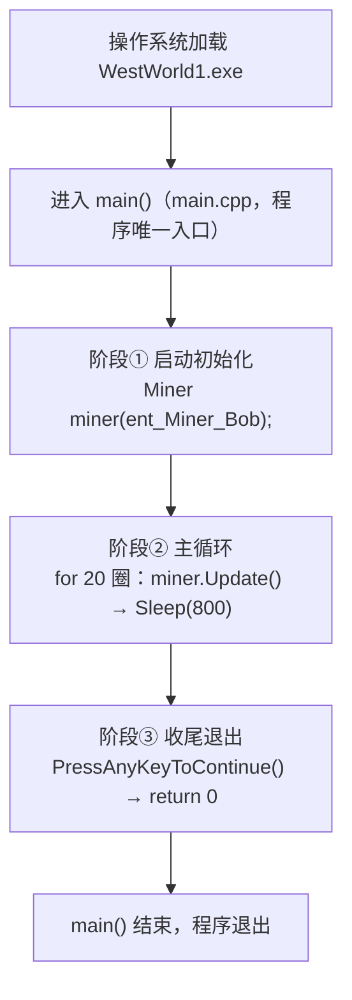
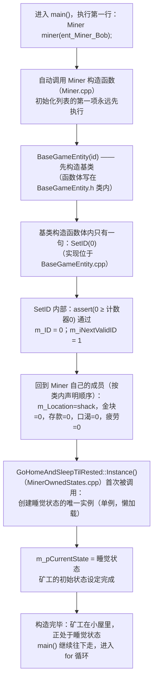
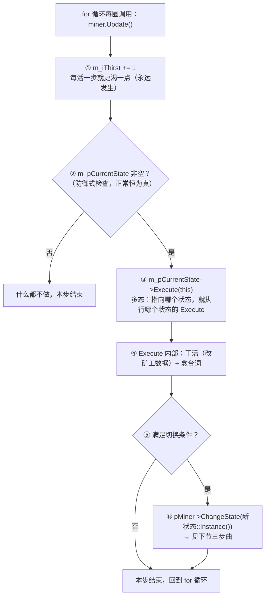
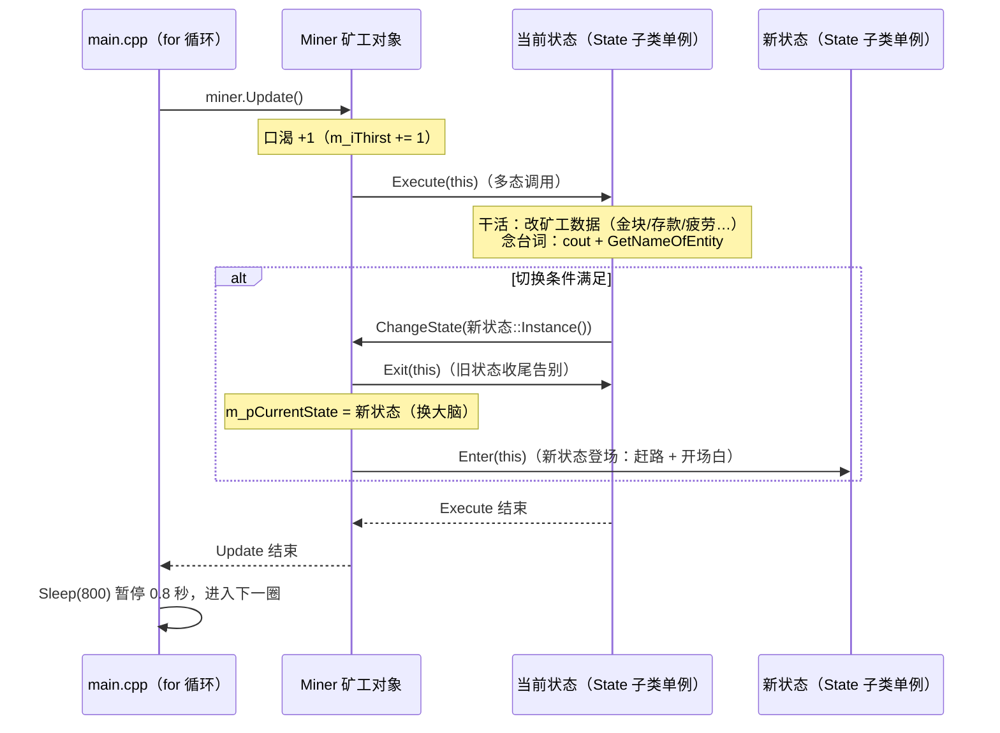
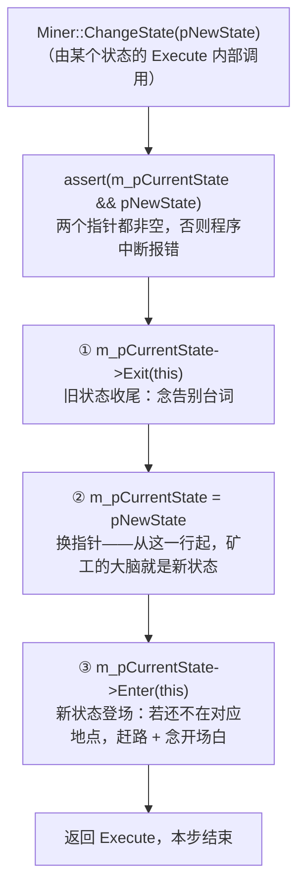
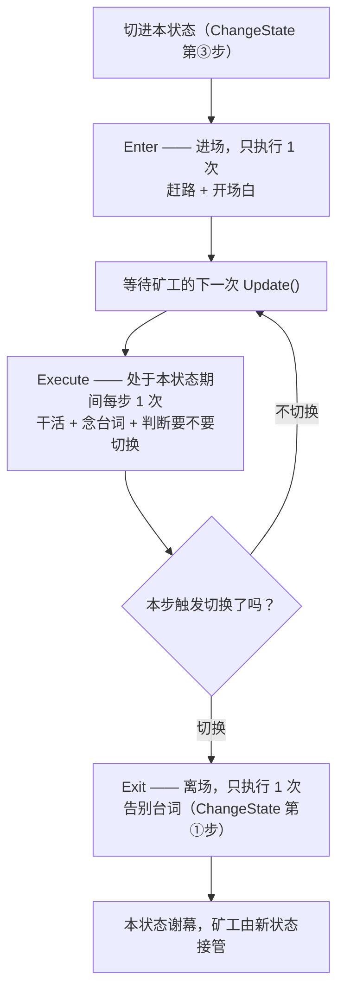
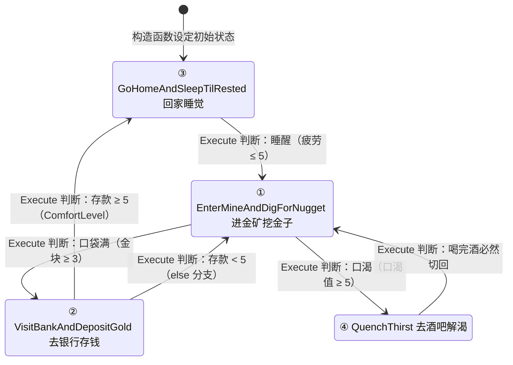
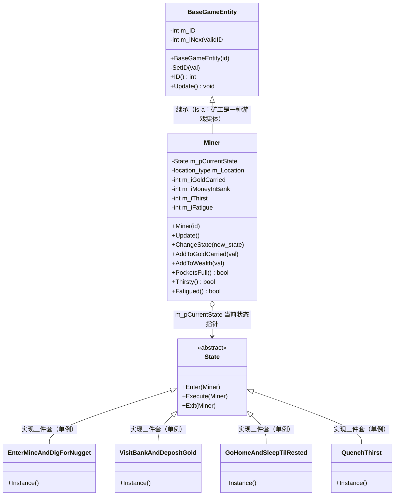
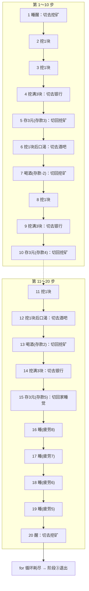
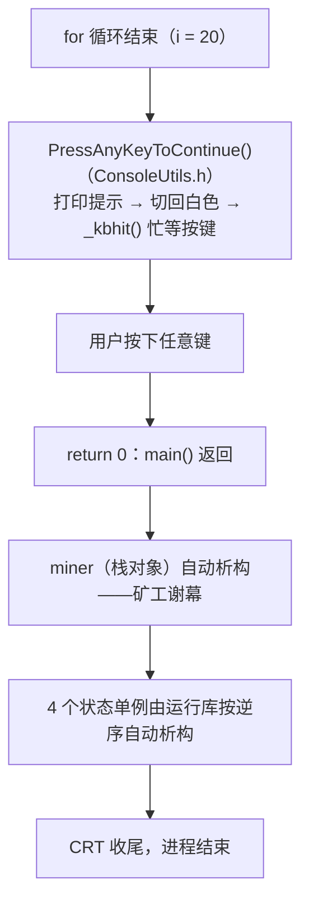

# WestWorld1 执行流程（从启动到结束）

WestWorld1 是《Programming Game AI by Example》第 2 章的第一个示例工程：黑色控制台里的"西部世界"，矿工 Bob 靠一台**有限状态机（FSM）**生活 20 步。

姊妹篇 `00-ReadCodeGuide-WestWorld1.md` 回答"**代码按什么顺序读**"，本文回答：

> **程序从哪一行开始执行？每一行代码按什么顺序被调用、跑完 20 步？最后在哪一行结束？**

全文流程图统一使用 Mermaid 标准语法，四种图各司其职：

```text
flowchart        执行顺序 / 调用顺序（本文主力）
sequenceDiagram  一次 Update 内的对象间消息时序
stateDiagram-v2  状态机的状态转换
classDiagram     支撑执行流程的静态类关系
```

---

# 一、全程总览：三个阶段

main.cpp 的有效代码只有三段——创建矿工、循环 20 步、等按键退出。程序生命周期也只有对应的三个阶段：



| 阶段 | 代码位置 | 执行次数 | 干什么 |
|------|----------|----------|--------|
| ① 启动初始化 | main.cpp 第 1 行 + Miner 构造函数链 | 1 次 | 造出矿工、设定初始状态 |
| ② 主循环 | main.cpp 的 for + Miner::Update + 状态类 Execute | 20 次 | 状态机运转（程序主体） |
| ③ 收尾退出 | main.cpp + Common\misc\ConsoleUtils.h | 1 次 | 等按键，返回 0 |

---

# 二、阶段①：启动初始化——一行代码引出整条构造链

## 1. main() 之前还发生了一件事

严格地说，进入 main() **之前**，C++ 运行库（CRT）的启动代码已经跑过一轮：
本工程唯一的全局初始化是 BaseGameEntity.cpp 里的这一行——

```text
int BaseGameEntity::m_iNextValidID = 0;   // 静态成员的"真身"定义
```

编号计数器在 main 之前就已归零，所以 main 里创建的第一个实体能拿到 0 号。

## 2. 完整构造链

main() 第一行 `Miner miner(ent_Miner_Bob);` 在栈上创建矿工对象，自动触发下面整条链：



## 3. 矿工出生时的初始值（构造链执行完的快照）

| 成员 | 初始值 | 含义 |
|------|--------|------|
| m_ID | 0（ent_Miner_Bob） | 唯一编号 |
| m_Location | shack | 出生在小屋 |
| m_iGoldCarried | 0 | 口袋空 |
| m_iMoneyInBank | 0 | 没存款 |
| m_iThirst | 0 | 不渴 |
| m_iFatigue | 0 | 不累 |
| m_pCurrentState | GoHomeAndSleepTilRested | **初始状态 = 回家睡觉** |

## 4. 本阶段要点

```text
① 构造顺序由 C++ 规定死：先基类构造，再按"类内声明顺序"逐个初始化成员。
② 单例是懒加载：睡觉状态在这次 Instance() 里才诞生；
   其余 3 个状态单例分别等到第一次被 ChangeState 切换时才创建。
③ 出生即"睡觉"，但疲劳 = 0 不满足"困"（Fatigued 要 > 5）→
   第 1 步矿工就会立刻睡醒切去挖矿——这也解释了输出为什么从"睡醒"开场。
```

---

# 三、阶段②：主循环——矿工"活一步"的完整流程

## 1. 主循环骨架

```text
for (int i=0; i<20; ++i)
{
    miner.Update();    // 矿工活一步（状态机的发动机）
    Sleep(800);        // 暂停 0.8 秒（剧场效果，避免 20 行瞬间刷完）
}
```

for 循环是整个程序唯一的"时间之箭"：每圈一次 Update，矿工的人生就前进一步。

## 2. Miner::Update 内部（Miner.cpp）



矿工自己只做两件事：**口渴 +1** 和**转发**。他从不决定"我该干什么"——
一切决策都在当前状态的 Execute 里。

## 3. 一步的完整时序（含一次状态切换）



## 4. Miner::ChangeState：换大脑三步曲（顺序固定，不能乱）



```text
为什么是这个顺序？
① 先让旧状态收尾告别（此时它还是"当前状态"，收得名正言顺）；
② 指针换完，后面的 Enter 才能以"新状态"的身份登场；
③ Enter 只负责进场布置，日常运转仍交给下一圈的 Execute。
```

## 5. State 三件套的调用时机

每个状态对象的三个函数，分别由谁、在什么时候调用：



| 接口函数 | 调用者 | 调用时机 |
|----------|--------|----------|
| Enter | Miner::ChangeState 第③步 | 每次切进这个状态，执行 1 次 |
| Execute | Miner::Update | 处于这个状态期间，每步 1 次 |
| Exit | Miner::ChangeState 第①步 | 每次切出这个状态，执行 1 次 |

---

# 四、运行期状态切换全景

## 1. 四状态转换图



## 2. 全部 6 条切换路径明细

| # | 方向 | 触发条件（判断代码） | 所在位置 |
|---|------|----------------------|----------|
| 1 | 睡觉 → 挖矿 | !Fatigued()，疲劳 ≤ TirednessThreshold(5) | GoHomeAndSleepTilRested::Execute |
| 2 | 挖矿 → 银行 | PocketsFull()，金块 ≥ MaxNuggets(3) | EnterMineAndDigForNugget::Execute |
| 3 | 挖矿 → 喝酒 | Thirsty()，口渴 ≥ ThirstLevel(5) | EnterMineAndDigForNugget::Execute |
| 4 | 银行 → 睡觉 | Wealth() ≥ ComfortLevel(5) | VisitBankAndDepositGold::Execute |
| 5 | 银行 → 挖矿 | 存款 < 5（else 分支） | VisitBankAndDepositGold::Execute |
| 6 | 喝酒 → 挖矿 | Thirsty() 成立时买酒后立即切回 | QuenchThirst::Execute |

（6 条切换路径全部写在 MinerOwnedStates.cpp，条件常量全部定义在 Miner.h）

## 3. 一个容易漏的细节：挖矿 Execute 的两个并排 if

```text
EnterMineAndDigForNugget::Execute 里是两个独立的 if（不是 if-else）：

    if (PocketsFull()) { ChangeState(银行); }   ← 先判断口袋
    if (Thirsty())     { ChangeState(酒吧); }   ← 再判断口渴

若某一步两个条件同时成立（口袋满 + 正好口渴）：
  第一个 if 先切去银行（银行的 Enter 已执行，人已到银行）；
  回到 Execute 后第二个 if 仍然成立 → 再从银行切去酒吧——
  矿工同一步内"刚进银行就转身去酒吧"。

本局 20 步恰好没同时发生过（口袋满时口渴值分别是 4、2、1，都 < 5），
但读代码必须知道存在这条路径；QuenchThirst::Execute 的 else（ERROR!）
是同类的防御性检查，正常永远走不到。
```

---

# 五、静态支撑：类关系图

上面所有流程图中的每个角色，对应下面这组类的分工：



```text
读图要点：
① Miner 的"大脑"只是一个 State* 指针——指向谁就执行谁（多态）；
② 4 个状态类都是单例：有函数、无成员变量，数据全在 Miner 对象里，
   所以全局一份就够，全世界通过 类名::Instance() 取实例；
③ BaseGameEntity 只管编号和"必须实现 Update"的规矩，不参与状态机。
```

## 执行流程 → 文件对照表（调用链落点）

| 环节 | 函数 | 所在文件 |
|------|------|----------|
| 0 | 静态计数器初始化（main 之前） | BaseGameEntity.cpp |
| 1 | main() | main.cpp |
| 2 | Miner::Miner(id) | Miner.cpp |
| 3 | BaseGameEntity::BaseGameEntity(id) → SetID(id) | BaseGameEntity.h / .cpp |
| 4 | GoHomeAndSleepTilRested::Instance() | MinerOwnedStates.cpp |
| 5 | Miner::Update() | Miner.cpp |
| 6 | 当前状态::Execute(this) | MinerOwnedStates.cpp |
| 7 | Miner::ChangeState(pNewState) | Miner.cpp |
| 8 | 旧状态::Exit / 新状态::Enter | MinerOwnedStates.cpp |
| 9 | 台词输出 SetTextColor + cout | MinerOwnedStates.cpp + Common\misc\ConsoleUtils.h |
| 10 | Sleep(800) | Windows API（windows.h，经 ConsoleUtils.h 间接包含） |
| 11 | PressAnyKeyToContinue() | Common\misc\ConsoleUtils.h |

---

# 六、20 步完整推演（可对照实际运行输出）

下面按代码逐行推演出全部 20 步——数据全部来自上面的规则，无一凭空。

## 1. 20 步状态轨迹



## 2. 逐步数据表（数值为该步结束时的快照）

| 步 | 执行的状态 | 本步行为与切换 | 口渴 | 金块 | 存款 | 疲劳 | 位置 |
|----|-----------|----------------|------|------|------|------|------|
| 1 | 睡觉③ | 疲劳 0 不困 → 睡醒，切挖矿（Exit 睡觉 / Enter 挖矿：走去金矿） | 1 | 0 | 0 | 0 | goldmine |
| 2 | 挖矿① | 挖 1 块 | 2 | 1 | 0 | 1 | goldmine |
| 3 | 挖矿① | 挖 1 块 | 3 | 2 | 0 | 2 | goldmine |
| 4 | 挖矿① | 挖满 3 块 → 切银行（走去银行） | 4 | 3 | 0 | 3 | bank |
| 5 | 银行② | 存 3 块；3 < 5 → 切回挖矿 | 5 | 0 | 3 | 3 | goldmine |
| 6 | 挖矿① | 挖 1 块后口渴 6 ≥ 5 → 切酒吧 | 6 | 1 | 3 | 4 | saloon |
| 7 | 喝酒④ | 买酒：口渴清零、存款 -2 → 切回挖矿 | 0 | 1 | 1 | 4 | goldmine |
| 8 | 挖矿① | 挖 1 块 | 1 | 2 | 1 | 5 | goldmine |
| 9 | 挖矿① | 挖满 3 块 → 切银行 | 2 | 3 | 1 | 6 | bank |
| 10 | 银行② | 存 3 块；4 < 5 → 切回挖矿 | 3 | 0 | 4 | 6 | goldmine |
| 11 | 挖矿① | 挖 1 块 | 4 | 1 | 4 | 7 | goldmine |
| 12 | 挖矿① | 挖 1 块后口渴 5 ≥ 5 → 切酒吧 | 5 | 2 | 4 | 8 | saloon |
| 13 | 喝酒④ | 买酒：口渴清零、存款 -2 → 切回挖矿 | 0 | 2 | 2 | 8 | goldmine |
| 14 | 挖矿① | 挖满 3 块 → 切银行 | 1 | 3 | 2 | 9 | bank |
| 15 | 银行② | 存 3 块；5 ≥ 5 → WooHoo！切回家睡觉（走回家） | 2 | 0 | 5 | 9 | shack |
| 16 | 睡觉③ | 还困（9 > 5）→ 睡 1 觉 | 3 | 0 | 5 | 8 | shack |
| 17 | 睡觉③ | 睡 1 觉 | 4 | 0 | 5 | 7 | shack |
| 18 | 睡觉③ | 睡 1 觉 | 5 | 0 | 5 | 6 | shack |
| 19 | 睡觉③ | 睡 1 觉 | 6 | 0 | 5 | 5 | shack |
| 20 | 睡觉③ | 疲劳 5 不 > 5 → 睡醒，切挖矿（走去金矿） | 7 | 0 | 5 | 5 | goldmine |

```text
推演要点（对照上表可验证）：
① 第 5 步口渴已到 5，但银行状态的 Execute 从不检查口渴——只有挖矿状态检查，
  所以矿工"憋着渴"把金子存完才继续挖，到第 6 步才被 Thirsty() 抓到。
② 第 15 步存款恰好达到 5（2 + 3），触发回家；此前两次存款 3、4 都不够。
③ 第 20 步睡醒时 for 循环恰好耗尽——程序结束时矿工正走在去金矿的路上，
  第 21 步（挖金）永远不会发生。结束时机由循环次数决定，与矿工状态无关。
```

## 3. 完整运行输出对照（带步骤标记）

实际运行的台词（红色高亮）逐行如下，可与上表逐格对照：

```text
── 第 1 步 ─────────────────────────────────────────
Miner Bob(矿工鲍勃): What a God darn fantastic nap! Time to find more gold(这觉睡得可真带劲！该去找更多金子啦)
Miner Bob(矿工鲍勃): Leaving the house(离开小屋)
Miner Bob(矿工鲍勃): Walkin' to the goldmine(走去金矿)
── 第 2 步 ─────────────────────────────────────────
Miner Bob(矿工鲍勃): Pickin' up a nugget(捡起一块金子)
── 第 3 步 ─────────────────────────────────────────
Miner Bob(矿工鲍勃): Pickin' up a nugget(捡起一块金子)
── 第 4 步 ─────────────────────────────────────────
Miner Bob(矿工鲍勃): Pickin' up a nugget(捡起一块金子)
Miner Bob(矿工鲍勃): Ah'm leavin' the goldmine with mah pockets full o' sweet gold(俺揣着满满一口袋甜金子离开金矿)
Miner Bob(矿工鲍勃): Goin' to the bank. Yes siree(去银行喽。是嘞)
── 第 5 步 ─────────────────────────────────────────
Miner Bob(矿工鲍勃): Depositing gold. Total savings now: (正在存金子。目前总存款：) 3
Miner Bob(矿工鲍勃): Leavin' the bank(离开银行)
Miner Bob(矿工鲍勃): Walkin' to the goldmine(走去金矿)
── 第 6 步 ─────────────────────────────────────────
Miner Bob(矿工鲍勃): Pickin' up a nugget(捡起一块金子)
Miner Bob(矿工鲍勃): Ah'm leavin' the goldmine with mah pockets full o' sweet gold(俺揣着满满一口袋甜金子离开金矿)
Miner Bob(矿工鲍勃): Boy, ah sure is thusty! Walking to the saloon(天哪，俺是真的渴坏了！这就走去酒吧)
── 第 7 步 ─────────────────────────────────────────
Miner Bob(矿工鲍勃): That's mighty fine sippin liquer(这口小酒喝着可真够劲儿)
Miner Bob(矿工鲍勃): Leaving the saloon, feelin' good(离开酒吧，感觉真不赖)
Miner Bob(矿工鲍勃): Walkin' to the goldmine(走去金矿)
── 第 8 步 ─────────────────────────────────────────
Miner Bob(矿工鲍勃): Pickin' up a nugget(捡起一块金子)
── 第 9 步 ─────────────────────────────────────────
Miner Bob(矿工鲍勃): Pickin' up a nugget(捡起一块金子)
Miner Bob(矿工鲍勃): Ah'm leavin' the goldmine with mah pockets full o' sweet gold(俺揣着满满一口袋甜金子离开金矿)
Miner Bob(矿工鲍勃): Goin' to the bank. Yes siree(去银行喽。是嘞)
── 第 10 步 ────────────────────────────────────────
Miner Bob(矿工鲍勃): Depositing gold. Total savings now: (正在存金子。目前总存款：) 4
Miner Bob(矿工鲍勃): Leavin' the bank(离开银行)
Miner Bob(矿工鲍勃): Walkin' to the goldmine(走去金矿)
── 第 11 步 ────────────────────────────────────────
Miner Bob(矿工鲍勃): Pickin' up a nugget(捡起一块金子)
── 第 12 步 ────────────────────────────────────────
Miner Bob(矿工鲍勃): Pickin' up a nugget(捡起一块金子)
Miner Bob(矿工鲍勃): Ah'm leavin' the goldmine with mah pockets full o' sweet gold(俺揣着满满一口袋甜金子离开金矿)
Miner Bob(矿工鲍勃): Boy, ah sure is thusty! Walking to the saloon(天哪，俺是真的渴坏了！这就走去酒吧)
── 第 13 步 ────────────────────────────────────────
Miner Bob(矿工鲍勃): That's mighty fine sippin liquer(这口小酒喝着可真够劲儿)
Miner Bob(矿工鲍勃): Leaving the saloon, feelin' good(离开酒吧，感觉真不赖)
Miner Bob(矿工鲍勃): Walkin' to the goldmine(走去金矿)
── 第 14 步 ────────────────────────────────────────
Miner Bob(矿工鲍勃): Pickin' up a nugget(捡起一块金子)
Miner Bob(矿工鲍勃): Ah'm leavin' the goldmine with mah pockets full o' sweet gold(俺揣着满满一口袋甜金子离开金矿)
Miner Bob(矿工鲍勃): Goin' to the bank. Yes siree(去银行喽。是嘞)
── 第 15 步 ────────────────────────────────────────
Miner Bob(矿工鲍勃): Depositing gold. Total savings now: (正在存金子。目前总存款：) 5
Miner Bob(矿工鲍勃): WooHoo! Rich enough for now. Back home to mah li'lle lady(哇噢！眼下够富有啦。回家找俺那小媳妇去)
Miner Bob(矿工鲍勃): Leavin' the bank(离开银行)
Miner Bob(矿工鲍勃): Walkin' home(走回家去)
── 第 16～19 步 ─────────────────────────────────────
Miner Bob(矿工鲍勃): ZZZZ... (呼噜噜……)
Miner Bob(矿工鲍勃): ZZZZ... (呼噜噜……)
Miner Bob(矿工鲍勃): ZZZZ... (呼噜噜……)
Miner Bob(矿工鲍勃): ZZZZ... (呼噜噜……)
── 第 20 步 ────────────────────────────────────────
Miner Bob(矿工鲍勃): What a God darn fantastic nap! Time to find more gold(这觉睡得可真带劲！该去找更多金子啦)
Miner Bob(矿工鲍勃): Leaving the house(离开小屋)
Miner Bob(矿工鲍勃): Walkin' to the goldmine(走去金矿)
── 阶段③ ────────────────────────────────────────────
Press any key to continue
```

```text
备注：
① 每步的台词顺序固定是"干活的台词 → 旧状态 Exit 告别 → 新状态 Enter 赶路"，
   因为 ChangeState 永远是 Exit 旧 → 换指针 → Enter 新。
② 喝酒状态的 Enter 是先搬位置再念台词（与其他三个状态相反），顺序无碍。
③ Press any key to continue 来自 Common\misc\ConsoleUtils.h（共享文件，按规范
   保留英文原文），并先把文字颜色从红色切回白色。
```

---

# 七、阶段③：收尾退出

for 循环 20 圈耗尽后，main() 还剩两行：

```text
PressAnyKeyToContinue();   // 打印提示 + _kbhit() 忙等，直到用户按任意键
return 0;                  // main 返回 0（正常结束），交给操作系统
```



注意：**程序的结束与矿工的状态无关**——不管 Bob 当时在挖矿还是睡觉，for 满 20 圈就收工。
本局第 20 步他刚睡醒、正走在去金矿的路上，"第 21 步"永远不会再发生。

---

# 八、要点回顾

```text
1. 执行起点    操作系统 → CRT 启动代码（全局静态初始化）→ main()
2. 初始化      一行 Miner miner(...) 触发：
               基类构造 → SetID → 成员按声明顺序初始化 → 取睡觉状态单例
3. 驱动者      for 循环是唯一的"时间之箭"：每圈 Update() + Sleep(800)
4. 决策者      Miner::Update 只做"口渴 +1"和"转发 Execute"；
               干什么、何时切换，全部写在状态类的 Execute 里
5. 切换        ChangeState 固定三步：Exit 旧 → 换指针 → Enter 新
6. 多态落点    m_pCurrentState->Execute(this)：一行代码，指向谁就执行谁
7. 单例        状态类无数据 → 全局一份；Instance() 首次调用才创建（懒加载）
8. 输出        台词 = 干活 → 旧 Exit 告别 → 新 Enter 赶路，顺序恒定
9. 结束        循环 20 次后 PressAnyKeyToContinue() → return 0 → 进程退出
```

> **main 只是"发心跳"的，矿工只是"转发"的，
> 真正写满全部人生剧本的，是那 4 个小小的状态类。**

---

# 九、下一步

```text
WestWorld1（本文）          单角色、无交流，最简 FSM 的执行流程
    ↓
WestWorldWithWoman         加入妻子 Elsa：两套各自独立的状态机并行运转，
                           阅读时可对照本文流程图，看第二个实体如何复用同一模式
    ↓
WestWorldWithMessaging     加入消息系统（Telegram / 消息派发）：
                           状态切换不再只由自身数据触发，还能被"收到的消息"触发
```

理论对照：FSM 的 State / Condition / Transition / CurrentState 概念与本文代码的对应关系，
见 `../Theory(理论)/2026-1002-00-FSM概念.md` 与 `../Theory(理论)/2026-1003-00-FSM流程图.md`。
