# 状态机（FSM）概念

**状态机（Finite State Machine，FSM，有限状态机）**是一种用来描述：

> **一个系统在不同状态之间，根据条件和事件发生转换的程序设计模型。**

它特别适合描述游戏中的角色、敌人、UI、任务、战斗、AI 等具有**明确阶段和行为切换**的系统。

---

## 1. 最核心的三个概念

一个状态机最基本由三个东西组成：

```text
状态（State）
    ↓
条件 / 事件（Condition / Event）
    ↓
状态转换（Transition）
```

例如一个游戏角色：

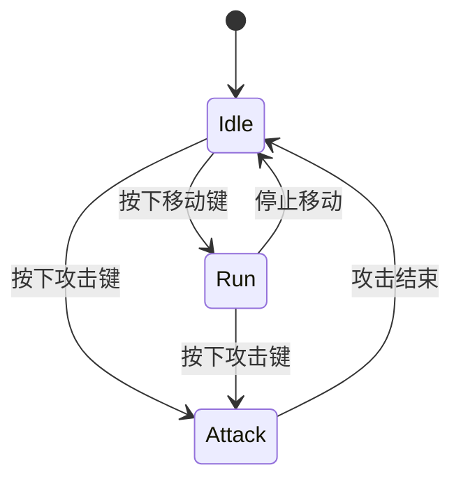

这里：

* `Idle`：当前角色处于**待机状态**
* `Run`：当前角色处于**移动状态**
* `Attack`：当前角色处于**攻击状态**
* `按下移动键`：触发状态转换的**条件/事件**
* `Idle --> Run`：表示发生了一次**状态转换**

---

# 2. 什么是「状态」

**状态就是系统当前所处的阶段。**

例如角色：

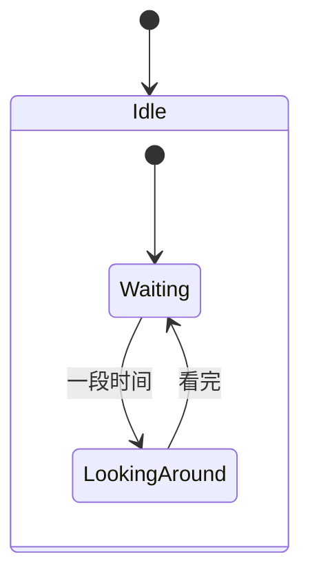

可以把 `Idle` 理解成：

> **角色现在正在做什么？**

例如：

| 状态     | 含义 |
| ------ | -- |
| Idle   | 待机 |
| Run    | 奔跑 |
| Attack | 攻击 |
| Hurt   | 受伤 |
| Dead   | 死亡 |

一个重要思想是：

> **状态描述的是“现在是什么情况”，而不是“接下来要做什么”。**

---

# 3. 什么是「状态转换」

状态转换就是：

> **系统从一个状态进入另一个状态。**

例如：

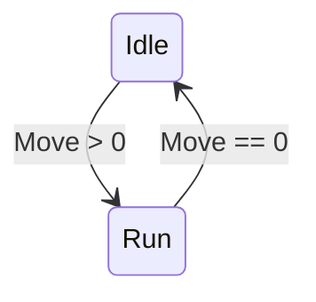

可以理解为：

```text
Idle
 │
 │ Move > 0
 ↓
Run
 │
 │ Move == 0
 ↓
Idle
```

因此：

```text
状态 + 条件
       ↓
    状态转换
       ↓
    新状态
```

---

# 4. 什么是「事件」

事件是**导致状态机重新判断状态的事情**。

例如：

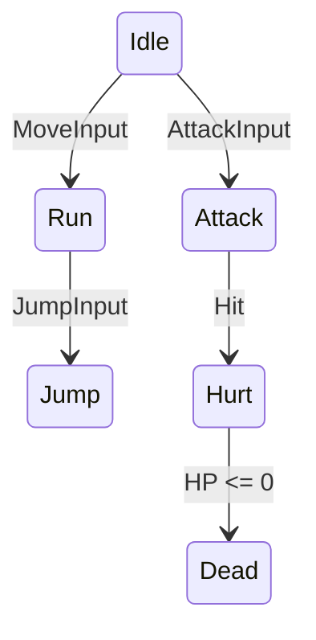

这里：

* `MoveInput` → 移动输入
* `AttackInput` → 攻击输入
* `JumpInput` → 跳跃输入
* `Hit` → 被攻击
* `HP <= 0` → 生命值归零

事件可以来自：

```text
玩家输入
   ↓
键盘 / 鼠标 / 手柄

游戏世界
   ↓
碰撞 / 触发器 / 敌人攻击

计时器
   ↓
攻击结束 / 技能结束

数据
   ↓
HP <= 0 / MP不足 / 子弹为0

其他系统
   ↓
任务完成 / 对话结束 / 游戏暂停
```

---

# 5. 状态机的完整结构

可以把一个 FSM 理解成：

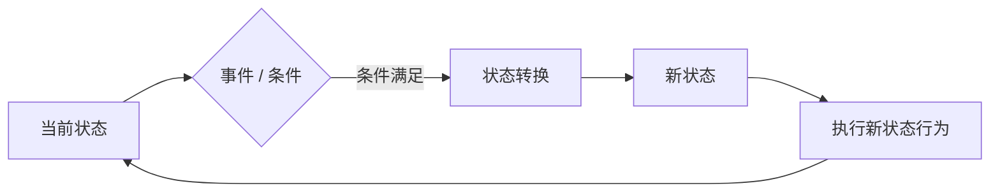

所以 FSM 实际上是在不断做：

```text
当前状态
    ↓
检查事件和条件
    ↓
是否需要切换？
    ↓
是
    ↓
退出当前状态
    ↓
进入新状态
    ↓
执行新状态
```

---

# 6. 一个完整的游戏角色 FSM

例如一个简单敌人：

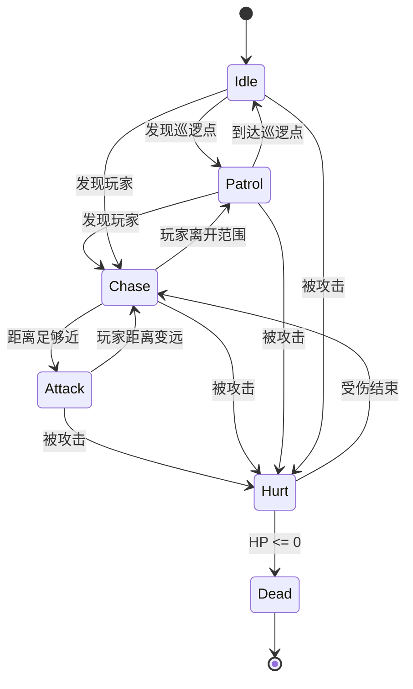

这就是一个非常典型的游戏 AI 状态机。

---

# 7. FSM 最重要的思想：任何时候都有一个「当前状态」

假设敌人现在正在追玩家：

```text
Enemy
  │
  └── CurrentState = Chase
```

那么此时：

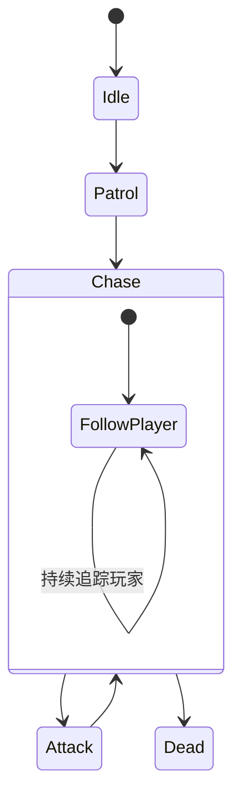

此时状态机主要关心：

```text
我现在是什么状态？
        ↓
Chase

在这个状态下应该做什么？
        ↓
追踪玩家

什么时候离开这个状态？
        ↓
玩家离开范围
或者
玩家死亡
或者
敌人死亡
```

---

# 8. 状态通常包含三个阶段

一个比较完整的状态通常可以拆成：

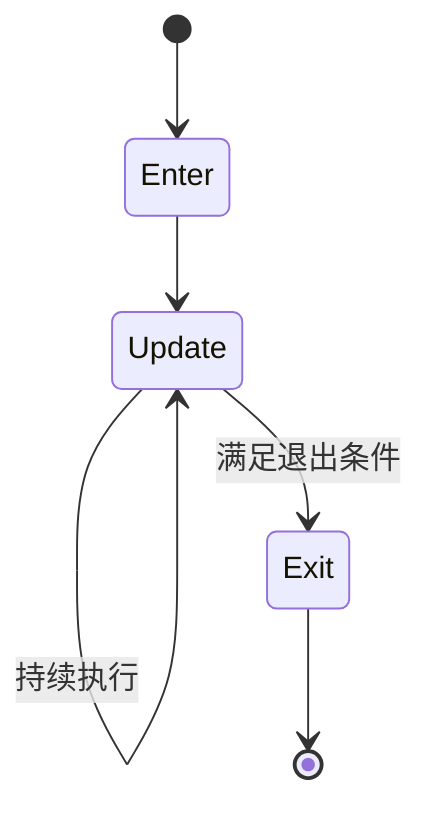

也就是：

```text
Enter
  ↓
进入状态时执行一次

Update
  ↓
状态持续期间不断执行

Exit
  ↓
离开状态时执行一次
```

例如攻击状态：

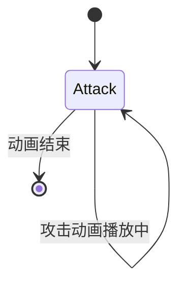

程序上可以理解为：

```csharp
Enter()
{
    播放攻击动画;
}

Update()
{
    检查攻击是否结束;
}

Exit()
{
    停止攻击;
}
```

---

# 9. FSM 的核心循环

一个 FSM 每一帧实际上可以进行类似这样的工作：

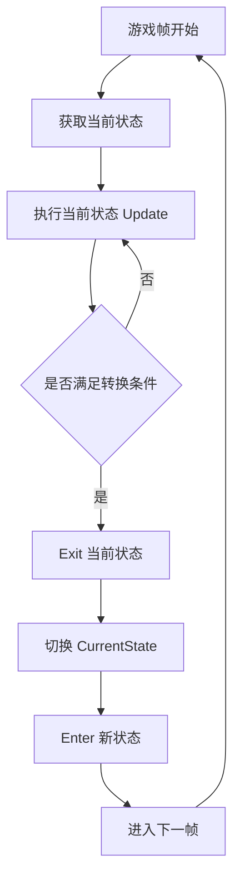

因此：

> **FSM 本质上就是一个“根据当前状态和条件，不断决定下一步行为”的系统。**

---

# 10. FSM 与普通 if-else 的区别

没有 FSM 时，代码可能变成：

```csharp
if (hp <= 0)
{
    Dead();
}
else if (isHurt)
{
    Hurt();
}
else if (distance < attackDistance)
{
    Attack();
}
else if (distance < chaseDistance)
{
    Chase();
}
else
{
    Patrol();
}
```

当游戏越来越复杂：

```text
Idle
Run
Jump
Fall
Attack
Skill
Hurt
Stun
Dead
Dash
Block
Parry
...
```

大量 `if / else` 会逐渐形成复杂的条件网络。

FSM 则把它整理成：

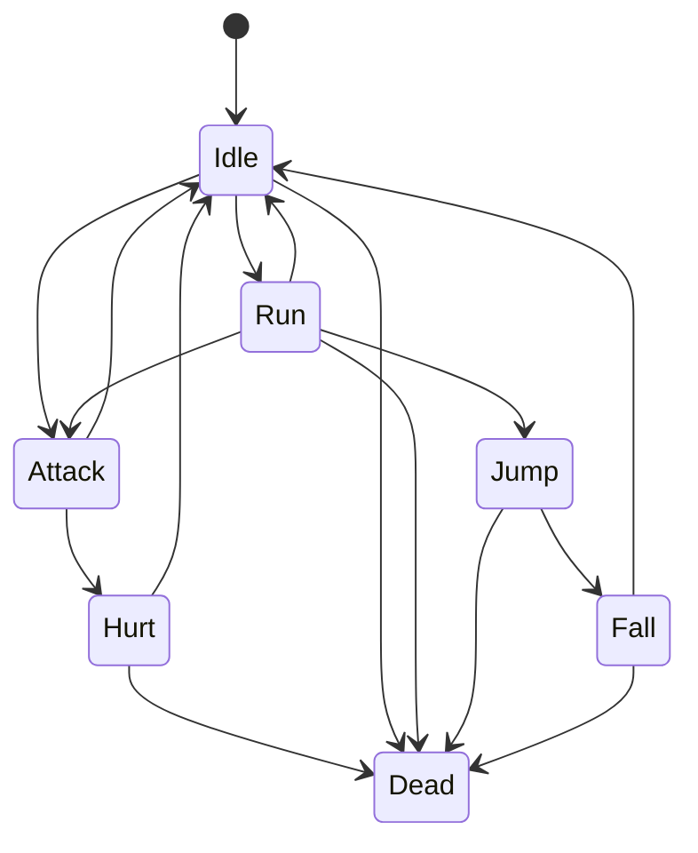

这样**状态之间的关系变得可视化**。

---

# 11. FSM 的数学抽象

有限状态机可以抽象成：

```text
FSM = (S, E, T)
```

其中：

* `S` = State，状态集合
* `E` = Event，事件集合
* `T` = Transition，状态转换规则

例如：

```text
S = {
    Idle,
    Run,
    Attack,
    Dead
}
```

事件：

```text
E = {
    Move,
    Stop,
    AttackInput,
    Die
}
```

转换规则：

```text
T(Idle, Move)        = Run
T(Run, Stop)         = Idle
T(Idle, AttackInput) = Attack
T(Run, AttackInput)  = Attack
T(Attack, Die)       = Dead
```

所以 FSM 的本质可以概括成：

> **输入一个事件，根据当前状态和转换规则，得到下一个状态。**

即：

```text
(CurrentState, Event)
          ↓
    Transition Rule
          ↓
      NextState
```

---

# 12. 游戏开发中的 FSM

FSM 在游戏里非常常见：

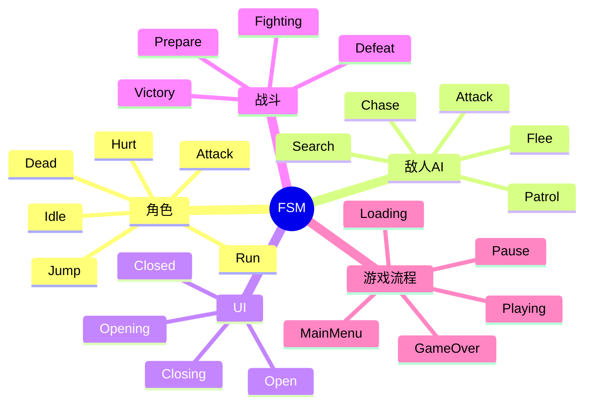

例如游戏流程：

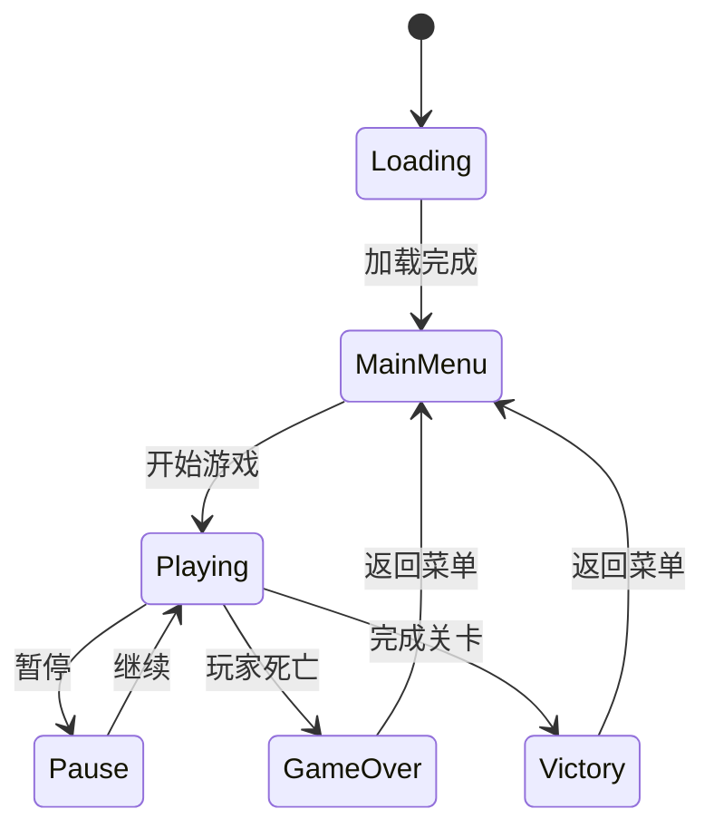

---

# 13. FSM 最值得记住的公式

可以把状态机浓缩成一句话：

```text
当前状态
    +
事件 / 条件
    ↓
状态转换
    ↓
下一个状态
```

进一步：

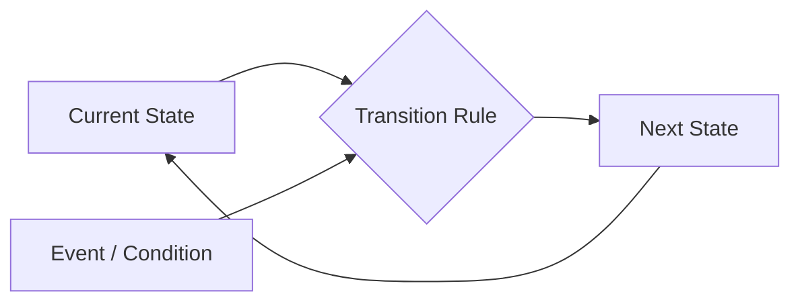

也就是：

> **状态机不是“做什么”的集合，而是“什么时候从一种行为切换到另一种行为”的规则集合。**

---

## 14. 最终理解

如果你正在学习 Unity 游戏开发，可以先把 FSM 理解成下面这个模型：

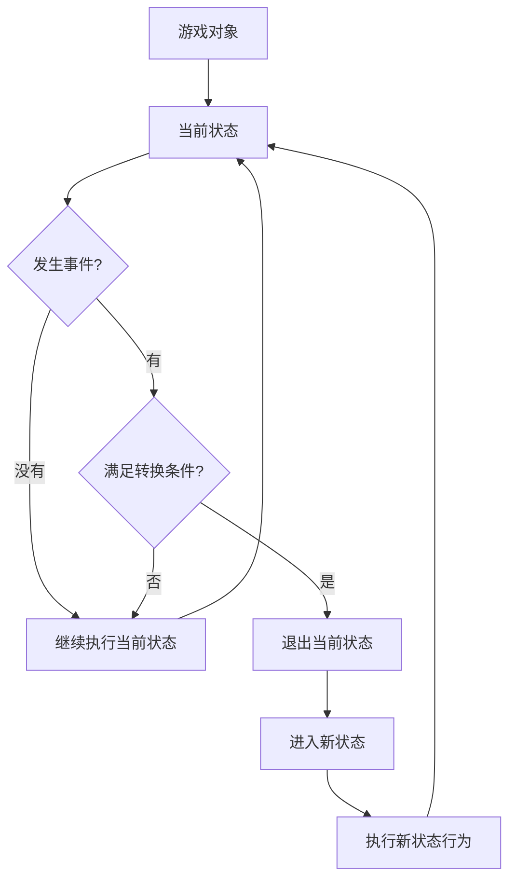

因此，一个 FSM 最核心的四个问题就是：

1. **我现在是什么状态？**
2. **这个状态下应该做什么？**
3. **什么事件会导致状态改变？**
4. **改变以后进入什么状态？**

对于 Unity 程序设计，可以进一步把它落到：

```text
IState
├── Enter()
├── Update()
└── Exit()

StateMachine
├── CurrentState
├── ChangeState()
└── Update()
```

这就从**“理解 FSM 概念”**进入了**“如何用 C# 实现 FSM 架构”**的阶段。
