# 消息管理器（Message Manager）概念

在游戏开发中，**消息管理器（Message Manager / Event Manager）**是一种用于解决：

> **“一个系统发生了事情，其他系统如何知道这件事？”**

的架构。

例如：

* 玩家死亡 → UI 显示“Game Over”
* 玩家获得金币 → UI 更新金币数量
* 敌人死亡 → 玩家获得奖励
* 游戏开始 → 音乐播放、计时器启动、UI切换
* 武器换弹完成 → UI更新弹药数量

如果没有消息管理器，系统之间很容易出现大量直接引用：

```text
Player → UI
Player → Audio
Player → GameManager
Player → Achievement
Player → Quest
...
```

最终形成严重的**系统耦合**。

---

## 1. 消息管理器解决什么问题？

可以先把问题抽象成：

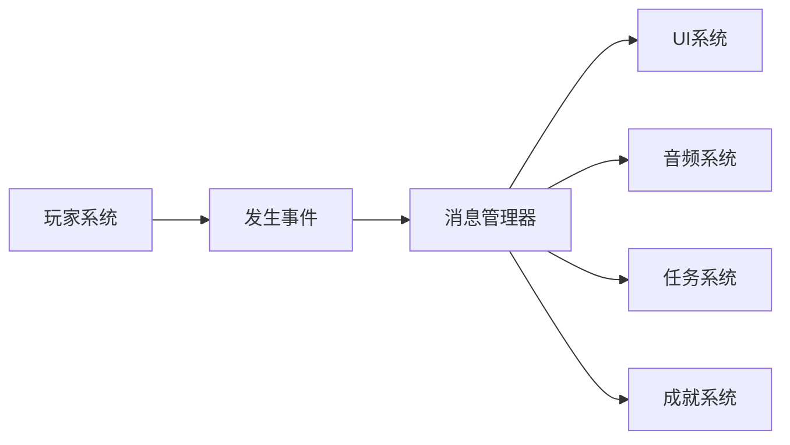

玩家只需要告诉消息管理器：

```text
“玩家获得了金币”
```

而不需要知道：

```text
UI怎么更新
音效怎么播放
任务怎么处理
成就怎么判断
```

这就是消息管理器最重要的价值：

> **发送者和接收者解耦。**

---

# 2. 什么是“消息”？

消息本质上就是：

> **对某件事情发生的描述。**

例如：

```csharp
PlayerDead
```

表示：

> 玩家死亡了。

再比如：

```csharp
CoinChanged
```

表示：

> 金币数量发生变化。

如果需要携带数据，可以：

```csharp
CoinChanged
{
    int amount;
}
```

表示：

> 金币发生变化，并告诉接收者变化了多少。

---

# 3. 消息管理器的核心结构

最基本的结构其实非常简单：

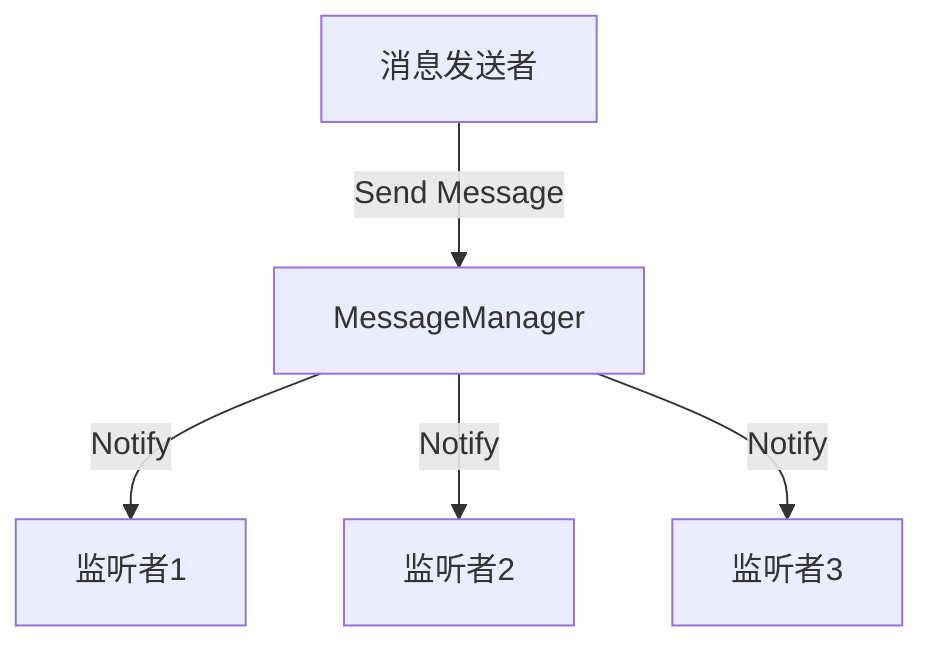

它主要包含三个角色：

### ① Sender

发送消息的人。

例如：

```csharp
Player
```

### ② MessageManager

负责保存：

```text
消息类型 → 哪些对象正在监听
```

### ③ Listener

监听消息的人。

例如：

```text
UI
Audio
Quest
Achievement
```

---

# 4. 消息管理器内部到底做什么？

假设有：

```text
PlayerDead
```

消息管理器内部可以理解成：

```text
PlayerDead
    ↓
┌──────────────────┐
│ MessageManager   │
├──────────────────┤
│ UI.OnPlayerDead  │
│ Audio.OnPlayerDead│
│ Game.OnPlayerDead │
│ Achievement...   │
└──────────────────┘
```

因此它内部通常维护一个类似这样的结构：

```csharp
Dictionary<Type, List<Delegate>>
```

也就是：

```text
消息类型
   ↓
监听者列表
```

例如：

```text
PlayerDead
    ↓
[UI处理函数]
[Audio处理函数]
[Game处理函数]
```

---

# 5. 完整消息生命周期

这是理解消息管理器最重要的一张流程图：

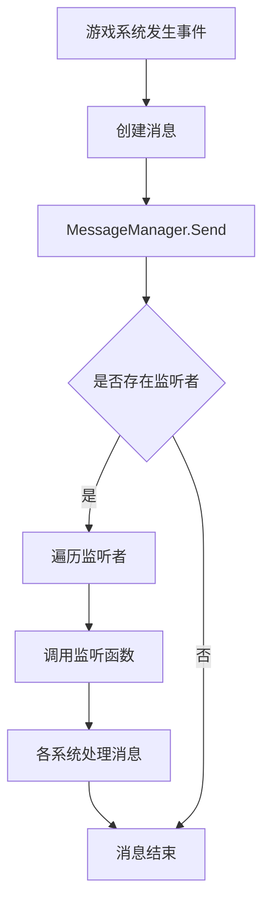

例如玩家死亡：

```text
Player
 ↓
PlayerDeadMessage
 ↓
MessageManager
 ↓
找到所有 PlayerDead 监听者
 ↓
UI
 ↓
显示 Game Over

Audio
 ↓
播放死亡音效

GameManager
 ↓
进入 GameOver 状态

Achievement
 ↓
检查成就
```

---

# 6. Unity中的简单实现

我们可以设计一个最基础的消息管理器。

## MessageManager

```csharp
using System;
using System.Collections.Generic;

public static class MessageManager
{
    private static readonly Dictionary<Type, List<Delegate>> listeners = new();

    public static void Subscribe<T>(Action<T> listener)
    {
        Type type = typeof(T);

        if (!listeners.TryGetValue(type, out var list))
        {
            list = new List<Delegate>();
            listeners[type] = list;
        }

        list.Add(listener);
    }

    public static void Unsubscribe<T>(Action<T> listener)
    {
        Type type = typeof(T);

        if (!listeners.TryGetValue(type, out var list))
            return;

        list.Remove(listener);

        if (list.Count == 0)
        {
            listeners.Remove(type);
        }
    }

    public static void Send<T>(T message)
    {
        Type type = typeof(T);

        if (!listeners.TryGetValue(type, out var list))
            return;

        foreach (var listener in list)
        {
            ((Action<T>)listener).Invoke(message);
        }
    }
}
```

---

# 7. 定义消息

例如玩家死亡：

```csharp
public struct PlayerDeadMessage
{
    public int playerId;

    public PlayerDeadMessage(int playerId)
    {
        this.playerId = playerId;
    }
}
```

这就是一条消息。

---

# 8. 发送消息

玩家死亡的时候：

```csharp
MessageManager.Send(
    new PlayerDeadMessage(playerId)
);
```

整个过程：

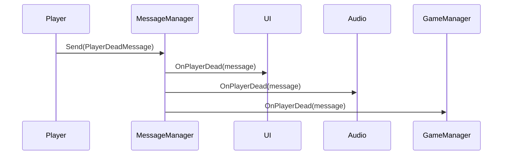

注意：

**Player根本不需要知道UI、Audio、GameManager的存在。**

---

# 9. 接收消息

UI：

```csharp
private void OnEnable()
{
    MessageManager.Subscribe<PlayerDeadMessage>(
        OnPlayerDead
    );
}

private void OnDisable()
{
    MessageManager.Unsubscribe<PlayerDeadMessage>(
        OnPlayerDead
    );
}

private void OnPlayerDead(PlayerDeadMessage message)
{
    gameOverPanel.SetActive(true);
}
```

Audio：

```csharp
private void OnEnable()
{
    MessageManager.Subscribe<PlayerDeadMessage>(
        OnPlayerDead
    );
}

private void OnDisable()
{
    MessageManager.Unsubscribe<PlayerDeadMessage>(
        OnPlayerDead
    );
}

private void OnPlayerDead(PlayerDeadMessage message)
{
    PlayDeathSound();
}
```

于是：

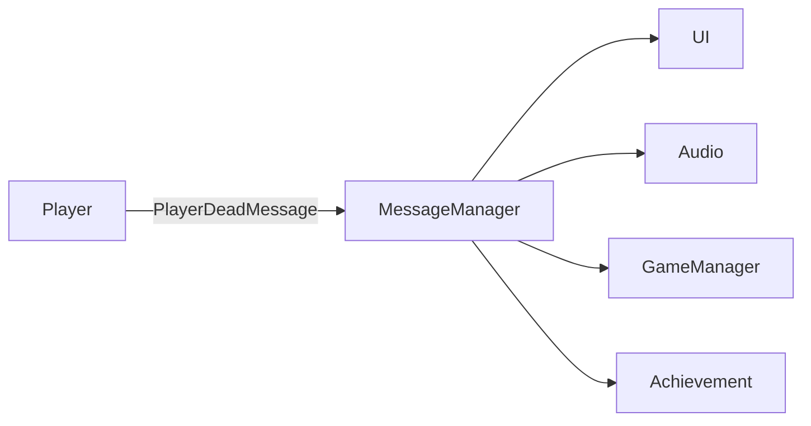

Player和这些系统之间没有直接引用。

---

# 10. 为什么这叫“解耦”？

没有消息管理器：

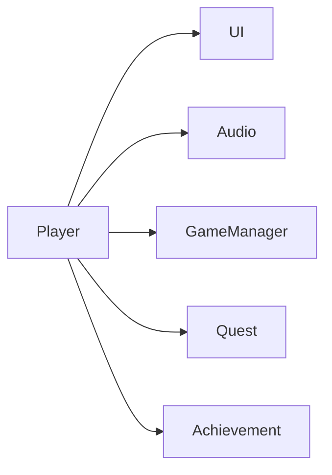

Player知道了太多东西。

如果以后增加：

```text
统计系统
录像系统
联网系统
排行榜
任务系统
```

Player可能变成：

```csharp
player.UI.xxx;
player.Audio.xxx;
player.GameManager.xxx;
player.Quest.xxx;
player.Achievement.xxx;
player.Statistics.xxx;
player.Network.xxx;
```

这就是典型的**高耦合**。

使用消息：

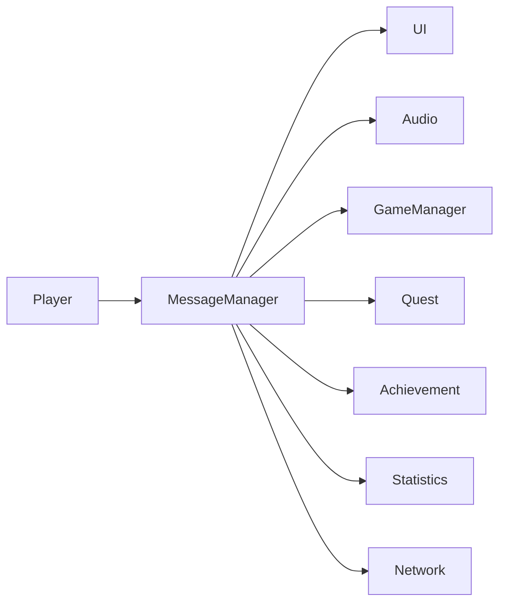

Player只关心：

```csharp
MessageManager.Send(...)
```

因此扩展系统时，Player基本不需要修改。

---

# 11. Subscribe / Unsubscribe / Send

消息管理器最核心的三个API就是：

```text
Subscribe
    ↓
订阅消息

Unsubscribe
    ↓
取消订阅

Send
    ↓
发送消息
```

对应：

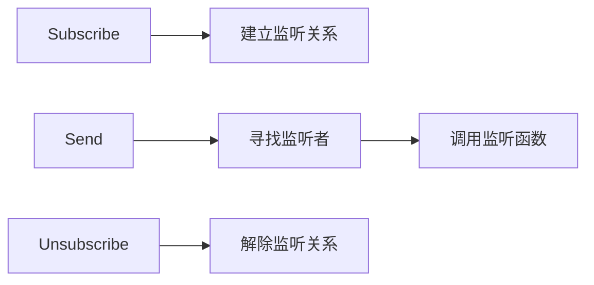

可以把它理解成微信公众号：

```text
用户
 ↓
订阅公众号

公众号发布消息
 ↓
所有订阅用户收到消息

用户取消关注
 ↓
以后不再收到消息
```

---

# 12. 消息管理器 ≠ 状态管理器

这两个概念很容易混淆。

### FSM

解决：

> **“现在处于什么状态？”**

例如：

```text
Idle
 ↓
Run
 ↓
Attack
 ↓
Dead
```

### MessageManager

解决：

> **“某件事情发生了，谁需要知道？”**

例如：

```text
PlayerAttack
PlayerDead
CoinChanged
WeaponChanged
GameStarted
GameOver
```

所以：

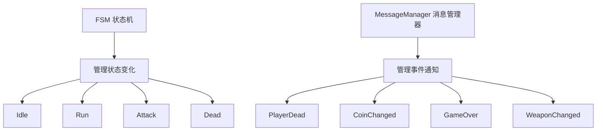

两者可以结合使用。

---

# 13. FSM + MessageManager

例如玩家死亡：

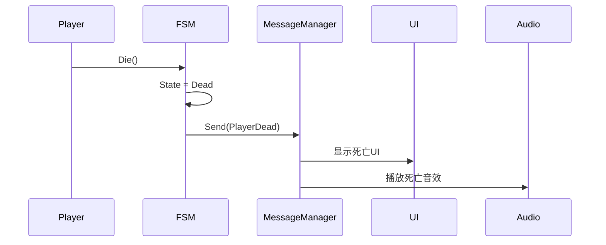

这里非常重要：

> **FSM负责决定“玩家进入Dead状态”，MessageManager负责通知其他系统“玩家死亡了”。**

职责不同。

---

# 14. 消息管理器的典型应用

在 Unity 游戏中非常适合用于：

### 玩家

```text
PlayerSpawned
PlayerDead
PlayerDamaged
PlayerLevelUp
```

### 战斗

```text
Attack
Hit
EnemyDead
BossDead
ComboChanged
```

### 道具

```text
ItemAdded
ItemRemoved
ItemUsed
```

### 金币

```text
CoinChanged
CoinEarned
CoinSpent
```

### 武器

```text
WeaponChanged
WeaponReload
AmmoChanged
```

### 游戏流程

```text
GameStarted
GamePaused
GameResumed
GameOver
GameVictory
```

### UI

```text
OpenWindow
CloseWindow
ShowPopup
```

---

# 15. 一个完整的游戏例子

假设你的FPS游戏中：

> 玩家击杀怪物 → 获得金币 → UI更新 → 播放音效 → 检查任务 → 检查成就

传统方式可能是：

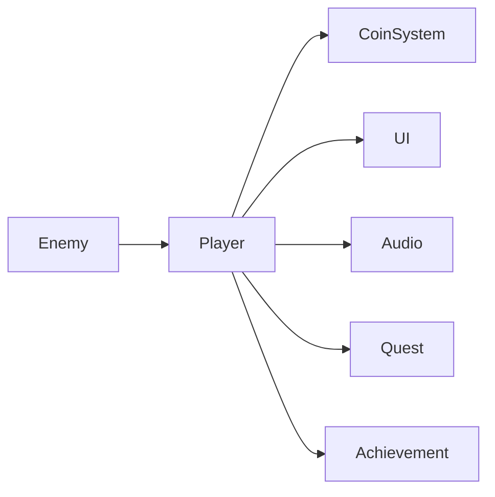

而消息系统可以变成：

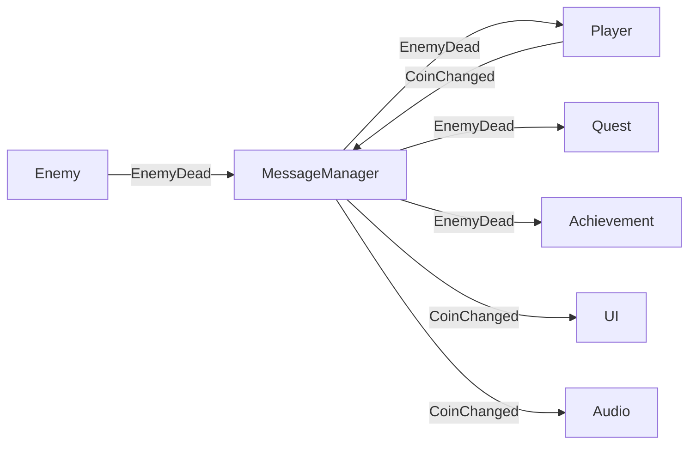

于是整个系统变成了一个**事件总线**。

---

# 16. 最重要的架构思想

可以把消息管理器理解成游戏中的：

> **“广播电台”**

发送者：

```text
“广播：玩家死亡了。”
```

消息管理器：

```text
“收到，我把这个消息广播出去。”
```

监听者：

```text
UI：我要处理。

Audio：我要处理。

GameManager：我要处理。

Achievement：我要处理。
```

发送者不需要知道到底有多少人接收。

---

# 17. 最终形成的游戏架构

一个比较合理的 Unity 架构可以是：

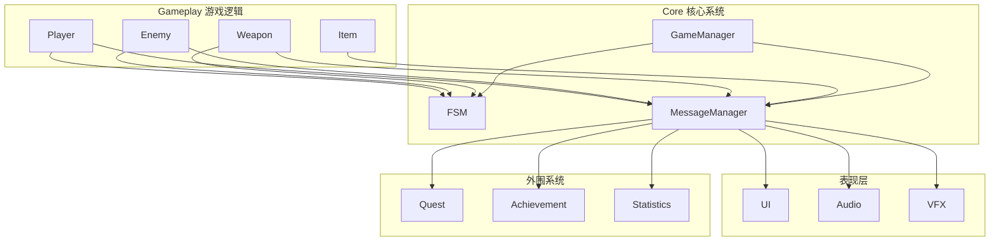

这里可以形成一个非常重要的设计原则：

> **业务系统负责产生事件，消息管理器负责传递事件，其他系统负责响应事件。**

---

## 18. 一句话理解

如果把游戏系统比喻成一个城市：

```text
FSM
= 每个系统内部的交通规则

MessageManager
= 城市里的广播系统

Message
= 广播内容

Subscribe
= 收听某个频道

Send
= 发布广播

Unsubscribe
= 取消收听
```

所以消息管理器的核心并不复杂：

```text
             Message
                │
                ▼
Sender ──→ MessageManager ──→ Listener
                │
                ├──→ UI
                ├──→ Audio
                ├──→ Quest
                ├──→ Achievement
                └──→ Statistics
```

**真正值得掌握的是“为什么要使用它”：**

> **用消息管理器把“谁产生事件”和“谁处理事件”分离开，从而降低系统之间的直接依赖，让游戏架构更容易扩展和维护。**
